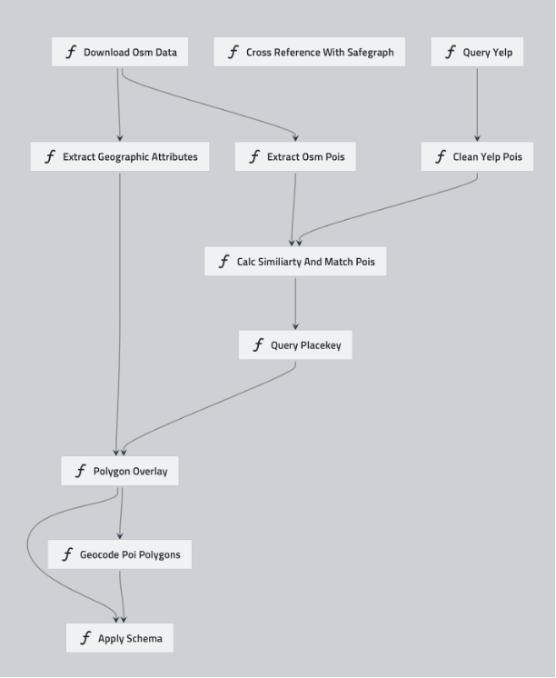

# Healthcare Point of Interest (POI) Conflation and Spatial Attribute Enrichment Framework

# Abstract

Healthcare Point of Interest (POI) data is an important source of semantic information about healthcare places, however, the task of retrieving accurate healthcare POI information is yet complicated. With the abundance of open-source projects and commercial geographical databases, POI conflation is a useful method to enrich spatial data attributes and coverage through merging POI records from different sources. This study is proposing a novel comprehensive healthcare POI conflation and spatial enrichment framework that engage in multi-step process; POI data collection from Location-Based Services (LBS), geographic and spatial attributes collection, calculating similarity across dataset and POI matching, spatial attributes enrichment, manual validation, Quality Control (QC), and finally a deployable enriched database. The viability of our proposed framework is tested on a case study of drug and substance abuse places in California. 

# Our approach

### Process Overview

Overview of the POI Conflation Process

#### LBS POI Collection 

The first step is collecting POI data from different sources to be conflated. In this step, we are proposing the use of LBS, because it allows searching for POIs based on a text query. 

#### Conflation Process

POIs from different sources sometimes follow different encoding systems, thus a thoughtful conflation policy is necessary to combine POIs databases. We are proposing a two-step conflation process. First, calculating similarity metrics for POIs' name, street address, zip code and distance from each other. The second step is performing POI matching based on similarity metrics thresholds using the following algorithm. 

Pseudocode for POI Matching Algorithm

#### Spatial Attributes Enrichment 

In order to obtain POI polygon shapes and Census Block Group, we apply point-in-polygon overlay of the POI locations into the building data from Open Street Maps (OSM) or Census Block Group (CBG) geometery from SafeGraph. 

#### Human in the Loop (HITL)

We propose using AWS Mechanical Turk (MTurk) as a crowdsourcing platform to label the quality of the POIs that we have collected, due to its simplicity, usability and low price.

We asked the labelers to call the location and answer the following questions to evaluate the quality of our POIs dataset 1) Is this organization relevant to [search term associated with the POI]? 2) When you talked to a person from the organization on the phone, did they confirm this is the current name? 3) When you talked to a person from the organization on the phone, did they confirm this is the current address? 

#### Quality Control

In order to evaluate the proposed method with respect to commercial datasets, we do a comparison between our dataset and a reference dataset. 

#### Final Database Design 

Final database is an important component of the conflation process. After the POIs matching is done and data is labeled for relevance and accuracy, the database design is what makes the produced dataset usable. Bellow is the proposed database design 

Proposed POIs Database Schema

### Pipeline 

We then converted the process into an automated pipeline using Kedro. Below is a picture representing the a visualization of the pipeline. Each node is a function written in python.

Visualization of the POI Conflation pipeline generated using Kedro Viz

